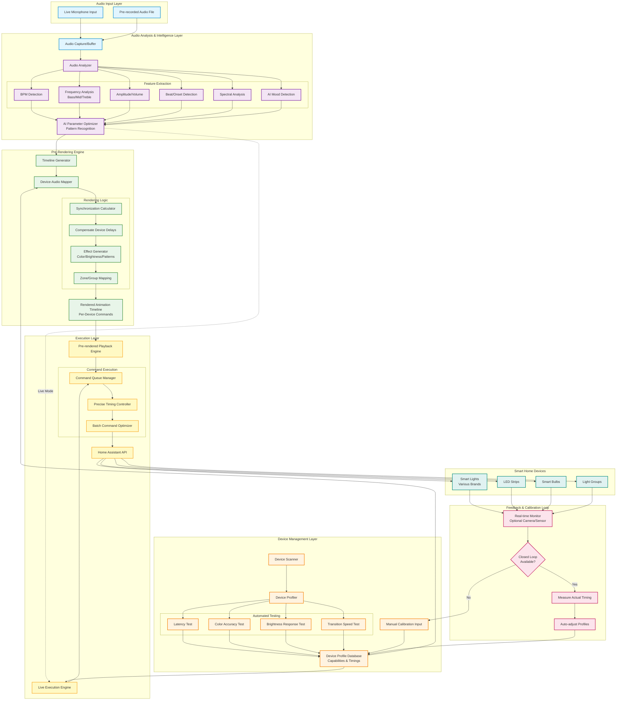

# Aurora - Sound-to-Light System Architecture

## Overview
Aurora is an intelligent sound-to-light module that analyzes audio and generates synchronized lighting animations across heterogeneous smart home lighting systems.

## System Architecture



## Key Components

### 1. Audio Analysis & Intelligence Layer
- **Real-time Audio Processing**: Captures and buffers audio from mic or file
- **Multi-dimensional Analysis**: 
  - BPM detection for rhythm synchronization
  - Frequency band separation (bass, mid, treble)
  - Beat onset detection for precise timing
  - Spectral analysis for color mapping
  - AI-powered mood detection for scene selection
- **AI Parameter Optimizer**: Learns optimal patterns and improves mapping over time

### 2. Device Management Layer
- **Automated Device Discovery**: Scans Home Assistant for all light entities
- **Device Profiling System**: 
  - Tests latency (command to visible response)
  - Color accuracy and gamut
  - Brightness response curves
  - Transition speed capabilities
- **Device Profile Database**: Stores calibration data per device/model
- **Manual Calibration**: Optional manual input for closed-loop testing

### 3. Pre-Rendering Engine (Primary Focus)
- **Timeline Generation**: Creates time-indexed animation sequence
- **Device-Aware Mapping**: Maps audio features to device-specific commands
- **Synchronization Calculator**: Accounts for device latencies
- **Delay Compensation**: Pre-adjusts timing per device characteristics
- **Effect Generation**: Creates color/brightness/pattern sequences
- **Zone Mapping**: Handles grouped lights and spatial distribution

### 4. Execution Layer
- **Live Mode**: Real-time processing with minimal latency
- **Pre-rendered Mode**: Playback of pre-calculated timeline with precise timing
- **Command Queue**: Manages command flow to prevent overwhelming devices
- **Batch Optimization**: Groups compatible commands for efficiency
- **Precise Timing**: Sub-100ms accuracy for synchronization

### 5. Feedback & Calibration Loop
- **Optional Monitoring**: Camera/sensor-based verification
- **Timing Measurement**: Actual response time logging
- **Auto-adjustment**: Refines device profiles based on measurements
- **Closed/Open Loop**: Supports both automatic and manual calibration

## Execution Modes

### Mode 1: Live via Microphone
```
Mic → Analysis → Live Execution → Lights
- Low latency priority
- Simplified effects
- Real-time compensation
```

### Mode 2: Pre-rendered (Primary)
```
Audio File → Full Analysis → Pre-rendering → Timeline → Playback → Lights
- Maximum quality
- Complex effects
- Perfect synchronization
- Device-optimized
```

## Device Heterogeneity Challenges

### Different Manufacturers = Different Behaviors
- **Latency**: 50ms to 500ms+ variation
- **Color Space**: RGB, RGBW, RGBWW, Tunable White
- **Transition Speed**: Fast (50ms) to Slow (2000ms+)
- **Refresh Rate**: Polling vs Push updates
- **Command Processing**: Sequential vs Parallel

### Aurora's Solution
1. **Profile Each Device**: One-time automated testing
2. **Compensate Timing**: Pre-calculate offsets per device
3. **Map Capabilities**: Use only supported features per device
4. **Test & Refine**: Optional closed-loop for perfect calibration

## Technical Requirements

### Audio Processing
- **Libraries**: Web Audio API, AudioWorklet, or native FFT
- **Sample Rate**: 44.1kHz minimum
- **Buffer Size**: Configurable (128-2048 samples)
- **Frequency Range**: 20Hz - 20kHz

### Device Communication
- **Protocol**: Home Assistant WebSocket API
- **Rate Limiting**: Respect HA limits (~60 commands/second)
- **Batching**: Group commands where possible
- **Error Handling**: Retry logic with exponential backoff

### Storage
- **Device Profiles**: SQLite or JSON file per device
- **Rendered Timelines**: JSON format with timestamp + commands
- **Audio Analysis Cache**: Store analysis results

### Performance
- **Pre-rendering**: Real-time factor of 2-10x (process 1min audio in 6-30s)
- **Live Mode**: <50ms latency target
- **Memory**: Streaming for large audio files

## Future Enhancements
- Machine learning for better audio-to-light mapping
- Spatial audio with positional lighting
- Music genre detection for preset selection
- Integration with music streaming services
- Multi-room synchronized playback
- Visual editor for timeline customization
